# Low-Level Design: ATM System
**(State Pattern + Chain of Responsibility)**

## 1. Project Overview
This project simulates an ATM using two primary design patterns.
1.  **State Pattern:** Manages the user interaction flow (Insert Card -> Enter Pin -> Select Operation), ensuring operations happen in the correct order.
2.  **Chain of Responsibility Pattern:** Handles the cash dispensing logic by breaking down the total amount into specific bill denominations ($50, $20, $10).

### Directory Structure
```text
src/
└── com/
    └── atm/
        ├── ATMApplication.java         [Driver]
        ├── ATM.java                    [Context]
        ├── model/
        │   ├── Card.java               [Entity]
        │   ├── Account.java            [Entity]
        │   └── TransactionType.java    [Enum]
        ├── dispenser/                  [Chain of Responsibility]
        │   ├── DispenseChain.java      [Interface]
        │   ├── Dollar50Dispenser.java  [Handler]
        │   ├── Dollar20Dispenser.java  [Handler]
        │   └── Dollar10Dispenser.java  [Handler]
        └── state/                      [State Pattern]
            ├── ATMState.java           [Interface]
            ├── IdleState.java          [Concrete State]
            ├── HasCardState.java       [Concrete State]
            ├── SelectOperationState.java [Concrete State]
```

---

## 2. Component Analysis

### A. The Dispenser Package (Chain of Responsibility)
* **Concept:** Instead of a single method calculating bills, we pass the "request" (amount to withdraw) along a chain of objects.
* **Flow:**
    1.  User requests $130.
    2.  `Dollar50Dispenser` takes two $50s ($100 total). Remaining: $30. Passes $30 to next link.
    3.  `Dollar20Dispenser` takes one $20. Remaining: $10. Passes $10 to next link.
    4.  `Dollar10Dispenser` takes one $10. Remaining: $0. Transaction Complete.
* **Why?** If we want to add a $100 bill dispenser later, we just add a class and link it to the front of the chain. We don't need to rewrite the entire calculation logic.

### B. The State Package (State Pattern)
* **Concept:** The ATM behaves differently based on its current status.
* **`IdleState`:** Only accepts card insertion.
* **`HasCardState`:** Only accepts PIN entry. Rejects new cards.
* **`SelectOperationState`:** Authenticated. Accepts withdrawal requests or balance checks.
* **Why?** This eliminates massive `if-else` or `switch` statements (e.g., `if (hasCard && pinEntered && !isDispensing) ...`).

---

## 3. UML Class Diagram

This diagram visualizes how the State Pattern manages flow and how the ATM delegates the physical act of giving money to the Dispenser Chain.

```mermaid
classDiagram
    %% --- Context ---
    namespace com.atm {
        class ATM {
            - ATMState atmState
            - Account currentAccount
            - DispenseChain dispenserChain
            + ATM()
            + initializeDispenserChain()
            + getDispenserChain() DispenseChain
        }
        class ATMApplication {
            + main(String[] args)$
        }
    }

    %% --- Chain of Responsibility ---
    namespace com.atm.dispenser {
        class DispenseChain {
            <<interface>>
            + setNextChain(DispenseChain next)
            + dispense(int currency)
        }
        class Dollar50Dispenser {
            + dispense(int currency)
        }
        class Dollar20Dispenser {
            + dispense(int currency)
        }
        class Dollar10Dispenser {
            + dispense(int currency)
        }
    }

    %% --- State Pattern ---
    namespace com.atm.state {
        class ATMState {
            <<interface>>
            + insertCard(ATM atm, Card card)
            + enterPin(ATM atm, int pin)
            + selectOperation(ATM atm, Type type, int amt)
            + ejectCard(ATM atm)
        }
        class IdleState {
            + insertCard()
        }
        class HasCardState {
            + enterPin()
        }
        class SelectOperationState {
            + selectOperation()
        }
    }

    %% Relationships
    ATM o-- ATMState : current state
    ATM *-- DispenseChain : manages
    ATMApplication ..> ATM : uses

    %% CoR Relationships
    DispenseChain <|.. Dollar50Dispenser : implements
    DispenseChain <|.. Dollar20Dispenser : implements
    DispenseChain <|.. Dollar10Dispenser : implements
    Dollar50Dispenser o-- DispenseChain : next
    Dollar20Dispenser o-- DispenseChain : next

    %% State Relationships
    ATMState <|.. IdleState : implements
    ATMState <|.. HasCardState : implements
    ATMState <|.. SelectOperationState : implements
```



---

## 4. Senior Level Interview Q&A

### Q1: What happens if the machine runs out of $20 notes? How does your Chain handle that?
**Answer:**
"In a basic CoR implementation, the request passes down blindly. However, a production-ready ATM requires **Smart Handlers**.
The `$20Dispenser` should check its hardware inventory first. If it is empty, it simply passes the *entire* remaining amount to the next handler (`$10Dispenser`) without taking any action. If the chain reaches the end and `remainder > 0`, we throw an `InsufficientCashException` and rollback the transaction."

### Q2: How do you handle a partial failure (e.g., Money deducted from account, but electricity goes out before dispensing)?
**Answer:**
"This requires **Transactional Atomicity** (ACID properties) and a **Two-Phase Commit** (2PC).
1.  **Prepare Phase:** The ATM logs a 'Pending Dispense' record locally and tells the Bank API to 'Hold' the funds.
2.  **Commit Phase:** The ATM attempts to dispense cash.
    * *Success:* ATM confirms to Bank API to finalize deduction.
    * *Failure/Crash:* Upon reboot, the ATM's `MaintenanceState` scans for pending logs. It detects the unfinished transaction and sends a 'Reversal/Rollback' request to the Bank API to release the held funds."

### Q3: Why is the State Pattern better than `switch(state)` inside the ATM class?
**Answer:**
"An ATM has complex transitions and rules. For example, if you enter a wrong PIN 3 times, you might transition to a `LockedCardState`.
If we used `switch` statements, every single method (`insertCard`, `enterPin`, `withdraw`) would contain a massive switch case checking the current flag. This violates the **Open/Closed Principle** and makes the code brittle. The State pattern distributes this logic into separate classes, making the `ATM` context class lightweight and easy to extend."

### Q4: How would you secure the Singleton nature of the ATM instance in a multi-threaded environment?
**Answer:**
"Since the ATM is a physical device, it inherently acts as a Singleton. However, regarding the software instance: I would use the **Bill Pugh Singleton Implementation** or an **Enum Singleton** to ensure thread safety during initialization.
More importantly, strict **synchronization** is needed on the `DispenseChain` methods to prevent two concurrent logical threads (e.g., a remote admin command and a local user) from triggering the hardware motor simultaneously."