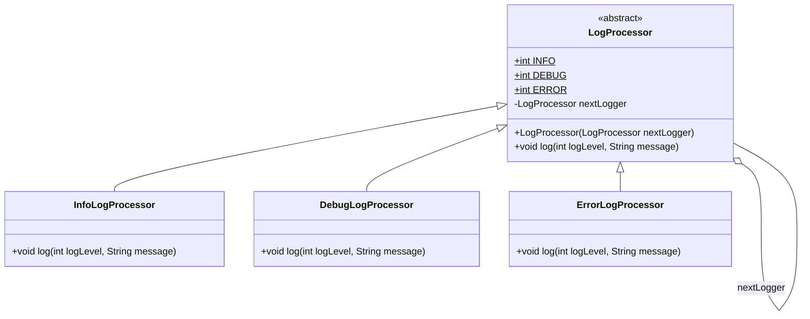

# Chain of Responsibility Pattern: Interview Guide & Documentation

## 1. Core Concept
**Definition:**
The Chain of Responsibility is a **behavioral design pattern** that lets you pass requests along a chain of handlers. Upon receiving a request, each handler decides either to process the request or to pass it to the next handler in the chain.

**The "Why":**
It decouples the sender of a request from its receivers. The sender doesn't need to know which specific object will handle the request; it just sends it to the first link in the chain.

### Real-world Analogy
Think of a **Technical Support Call Center**:
1.  **Level 1 (Automated/Junior):** Receives the call. If simple (e.g., password reset), handles it. If not, passes to Level 2.
2.  **Level 2 (Specialist):** If it's a known software bug, handles it. If not, passes to Level 3.
3.  **Level 3 (Engineer):** Fixes the code.

### Key Components
1.  **Handler (Abstract Class/Interface):** Declares the interface common to all handlers and maintains a reference to the `next` handler.
2.  **Concrete Handlers:** Contains the actual logic to process requests. Decides whether to handle it or pass it along.
3.  **Client:** Assembles the chain and triggers the first handler.

---

## 2. UML Diagram (Logging Processor)


## 📂 Project Structure
```text
src/
├── LogProcessor.java        // Abstract Handler
├── InfoLogProcessor.java    // Concrete Handler 1
├── DebugLogProcessor.java   // Concrete Handler 2
├── ErrorLogProcessor.java   // Concrete Handler 3
└── Main.java                // Client
```
## 💻 Implementation Details
**1. Abstract Handler** (```LogProcessor.java```) \
   Defines the `nextLogger` and the logic to traverse the chain.
```java
public abstract class LogProcessor {
    public static int INFO = 1;
    public static int DEBUG = 2;
    public static int ERROR = 3;

    LogProcessor nextLogger;

    public LogProcessor(LogProcessor nextLogger) {
        this.nextLogger = nextLogger;
    }

    public void log(int logLevel, String message) {
        // If the next link exists, pass the request down
        if (nextLogger != null) {
            nextLogger.log(logLevel, message);
        }
    }
}
```

**2. Concrete Handlers** \
    These classes check the log level. If it matches, they print. They typically call ```super.log()``` to keep the chain moving. \
   (Note: ```DebugLogProcessor``` and ```ErrorLogProcessor``` follow the exact same structure, checking for ```DEBUG``` and ```ERROR``` constants respectively.)

**InfoLogProcessor.java**
```java
public class InfoLogProcessor extends LogProcessor {
    public InfoLogProcessor(LogProcessor nextLogger) {
        super(nextLogger);
    }
    public void log(int logLevel, String message) {
        if (logLevel == INFO) {
            System.out.println("INFO: " + message);
        }
        super.log(logLevel, message);
    }
}
```
3. Client (```Main.java```) \
      Assembles the chain.
```java
public class Main {
    public static void main(String[] args) {
        // Build Chain: Info -> Debug -> Error
        LogProcessor logObject = new InfoLogProcessor(
                                    new DebugLogProcessor(
                                        new ErrorLogProcessor(null)
                                    )
                                );

        // This request will be handled by Error processor AND passed down if configured
        logObject.log(LogProcessor.ERROR, "DB Connection Failed"); 
    }
}
```

## 🎓 Interview Guide (Q&A)

### 🧠 Conceptual Questions

**Q1: What problem does this pattern solve?**
> It solves the problem of **coupling** the sender of a request to a specific receiver. Instead of the sender having complex `if-else` logic to decide who handles a request, it sends it to the first object in a chain, and the objects decide amongst themselves.

**Q2: How does it support the Open/Closed Principle?**
> You can add a new handler (e.g., `AuditLogProcessor`) **without modifying the existing code** in the base `LogProcessor` or the other handlers. You only need to update the chain assembly in the Client code.

---

### 🛠️ Implementation Questions

**Q3: Where is this used in Java Frameworks?**
> * **Servlet Filters:** Requests pass through a chain (`Auth` → `Log` → `Compress`) before hitting the Servlet.
> * **Spring Security:** Uses a `SecurityFilterChain` to handle authentication and authorization.
> * **Java Exceptions:** The `try-catch` mechanism searches up the call stack (chain) until it finds a handler.

**Q4: What is the difference between Chain of Responsibility and Decorator?**
> * **🔗 Chain of Responsibility:** Intent is to **pass responsibility**. It often implies that the request might not be handled at all, or handled by just one link.
> * **🎁 Decorator:** Intent is to **add behavior**. It wraps an object and almost always executes its own logic *plus* the wrapped object's logic.

**Q5: What is a potential downside?**
> **⚠️ Unassured Receipt:** A request might fall off the end of the chain without being handled if no processor accepts it and no default ("catch-all") handler is defined.