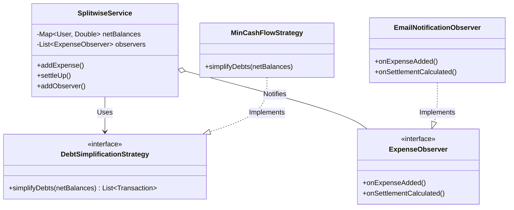

# Low-Level Design: Splitwise "Simplify Debt" Feature

## 1. Overview
This design implements a debt simplification system (like Splitwise) in Java. It solves the problem of circular or redundant debts (e.g., A owes B $10, B owes C $10 → A should just owe C $10) to reduce the total number of physical payments required.

**Key Features:**
* **Graph Simplification:** Uses a greedy algorithm (minimize cash flow) to reduce the total number of transactions.
* **Strategy Pattern:** Allows swapping the simplification algorithm (e.g., Greedy vs. Max Flow) without changing business logic.
* **Observer Pattern:** Decouples the core logic from notifications (Email, SMS).

---

## 2. Architecture Diagram



---

## 3. Project Structure

```text
src/
├── model/
│   ├── User.java                  // POJO: System User
│   ├── Transaction.java           // POJO: Final payment instruction
├── observer/
│   ├── ExpenseObserver.java       // Interface: Notification contract
│   ├── EmailNotificationObserver.java // Implementation: Email sender
├── strategy/
│   ├── DebtSimplificationStrategy.java // Interface: Algorithm contract
│   ├── MinCashFlowStrategy.java   // Implementation: Greedy Algorithm
├── service/
│   ├── SplitwiseService.java      // Core Business Logic
└── Driver.java                    // Main Execution Class
```

---

## 4. Implementation Code

### A. Models

**File:** `src/model/User.java`
```java
package model;

import java.util.Objects;

public class User {
    private String id;
    private String name;

    public User(String id, String name) {
        this.id = id;
        this.name = name;
    }

    public String getName() { return name; }

    @Override
    public boolean equals(Object o) {
        if (this == o) return true;
        if (o == null || getClass() != o.getClass()) return false;
        User user = (User) o;
        return Objects.equals(id, user.id);
    }

    @Override
    public int hashCode() { return Objects.hash(id); }
}
```

**File:** `src/model/Transaction.java`
```java
package model;

public class Transaction {
    private User from;
    private User to;
    private double amount;

    public Transaction(User from, User to, double amount) {
        this.from = from;
        this.to = to;
        this.amount = amount;
    }

    @Override
    public String toString() {
        return String.format("➡️  %s pays %s: $%.2f", from.getName(), to.getName(), amount);
    }
}
```

---

### B. Strategy Pattern (The Algorithm)

**File:** `src/strategy/DebtSimplificationStrategy.java`
```java
package strategy;

import model.User;
import model.Transaction;
import java.util.List;
import java.util.Map;

public interface DebtSimplificationStrategy {
    List<Transaction> simplifyDebts(Map<User, Double> netBalances);
}
```

**File:** `src/strategy/MinCashFlowStrategy.java`
```java
package strategy;

import model.User;
import model.Transaction;
import java.util.*;

public class MinCashFlowStrategy implements DebtSimplificationStrategy {

    @Override
    public List<Transaction> simplifyDebts(Map<User, Double> netBalances) {
        List<Transaction> transactions = new ArrayList<>();
        
        // Convert map to list for easy sorting
        List<Map.Entry<User, Double>> balances = new ArrayList<>(netBalances.entrySet());

        // Remove users who are already settled (balance is 0)
        balances.removeIf(entry -> entry.getValue() == 0);

        simplifyRecursive(balances, transactions);
        return transactions;
    }

    private void simplifyRecursive(List<Map.Entry<User, Double>> balances, List<Transaction> transactions) {
        // Base Case: No one left to settle
        if (balances.isEmpty()) return;

        // Sort: Index 0 = Max Debtor (-ve), Last Index = Max Creditor (+ve)
        balances.sort(Map.Entry.comparingByValue());

        Map.Entry<User, Double> maxDebtor = balances.get(0);
        Map.Entry<User, Double> maxCreditor = balances.get(balances.size() - 1);

        double debit = maxDebtor.getValue();
        double credit = maxCreditor.getValue();

        // Check for floating point residuals to avoid infinite loops
        if (Math.abs(debit) < 0.01 && Math.abs(credit) < 0.01) return;

        // Settle the minimum of the two absolute amounts
        double minAmount = Math.min(Math.abs(debit), credit);
        
        // Record the transaction
        transactions.add(new Transaction(maxDebtor.getKey(), maxCreditor.getKey(), minAmount));

        // Update balances
        maxDebtor.setValue(debit + minAmount);
        maxCreditor.setValue(credit - minAmount);

        // Remove settled users
        if (Math.abs(maxDebtor.getValue()) < 0.01) balances.remove(maxDebtor);
        if (Math.abs(maxCreditor.getValue()) < 0.01) balances.remove(maxCreditor);

        // Recurse
        simplifyRecursive(balances, transactions);
    }
}
```

---

### C. Observer Pattern (Notifications)

**File:** `src/observer/ExpenseObserver.java`
```java
package observer;

import model.User;
import model.Transaction;
import java.util.List;

public interface ExpenseObserver {
    void onExpenseAdded(User paidBy, double amount, List<User> splitBetween);
    void onSettlementCalculated(List<Transaction> transactions);
}
```

**File:** `src/observer/EmailNotificationObserver.java`
```java
package observer;

import model.User;
import model.Transaction;
import java.util.List;

public class EmailNotificationObserver implements ExpenseObserver {
    @Override
    public void onExpenseAdded(User paidBy, double amount, List<User> splitBetween) {
        System.out.println("📧 [Email Service] Alert: " + paidBy.getName() + " added an expense of $" + amount);
    }

    @Override
    public void onSettlementCalculated(List<Transaction> transactions) {
        System.out.println("📧 [Email Service] Alert: Settlement plan generated with " + transactions.size() + " transfers.");
    }
}
```

---

### D. Service Layer (Business Logic)

**File:** `src/service/SplitwiseService.java`
```java
package service;

import model.User;
import model.Transaction;
import observer.ExpenseObserver;
import strategy.DebtSimplificationStrategy;

import java.util.ArrayList;
import java.util.HashMap;
import java.util.List;
import java.util.Map;

public class SplitwiseService {
    private Map<User, Double> netBalances;
    private DebtSimplificationStrategy strategy;
    private List<ExpenseObserver> observers;

    public SplitwiseService(DebtSimplificationStrategy strategy) {
        this.netBalances = new HashMap<>();
        this.strategy = strategy;
        this.observers = new ArrayList<>();
    }

    // --- Observer Management ---
    public void addObserver(ExpenseObserver observer) {
        this.observers.add(observer);
    }

    // --- Core Features ---
    public void addUser(User user) {
        netBalances.putIfAbsent(user, 0.0);
    }

    public void addExpense(User paidBy, double amount, List<User> splitBetween) {
        double splitAmount = amount / splitBetween.size();

        // 1. Payer receives positive balance (credit)
        netBalances.put(paidBy, netBalances.getOrDefault(paidBy, 0.0) + amount);

        // 2. Splitters receive negative balance (debit)
        for (User user : splitBetween) {
            netBalances.put(user, netBalances.getOrDefault(user, 0.0) - splitAmount);
        }

        // 3. Notify
        notifyExpenseAdded(paidBy, amount, splitBetween);
    }

    public List<Transaction> settleUp() {
        // Delegate to strategy
        List<Transaction> transactions = strategy.simplifyDebts(netBalances);
        
        // Notify
        notifySettlement(transactions);
        
        return transactions;
    }

    private void notifyExpenseAdded(User paidBy, double amount, List<User> splitBetween) {
        for (ExpenseObserver obs : observers) obs.onExpenseAdded(paidBy, amount, splitBetween);
    }

    private void notifySettlement(List<Transaction> transactions) {
        for (ExpenseObserver obs : observers) obs.onSettlementCalculated(transactions);
    }
}
```

---

### E. Driver (Main)

**File:** `src/Driver.java`
```java
import model.User;
import model.Transaction;
import service.SplitwiseService;
import strategy.MinCashFlowStrategy;
import observer.EmailNotificationObserver;

import java.util.Arrays;
import java.util.List;

public class Driver {
    public static void main(String[] args) {
        // 1. Setup Data
        User alice = new User("u1", "Alice");
        User bob = new User("u2", "Bob");
        User charlie = new User("u3", "Charlie");

        // 2. Initialize Service with Greedy Strategy
        SplitwiseService service = new SplitwiseService(new MinCashFlowStrategy());

        // 3. Attach Observer
        service.addObserver(new EmailNotificationObserver());

        // 4. Register Users
        service.addUser(alice);
        service.addUser(bob);
        service.addUser(charlie);

        // 5. Add Expenses
        // Alice pays 300 for everyone. (Alice: +200, Bob: -100, Charlie: -100)
        service.addExpense(alice, 300, Arrays.asList(alice, bob, charlie));
        
        // Bob pays 100 for Alice. 
        service.addExpense(bob, 100, Arrays.asList(alice));

        // 6. Execute Simplification
        System.out.println("\n--- Calculating Final Settlement ---");
        List<Transaction> finalSettlement = service.settleUp();
        
        System.out.println("\n--- Final Transactions ---");
        for(Transaction t : finalSettlement) {
            System.out.println(t);
        }
    }
}
```