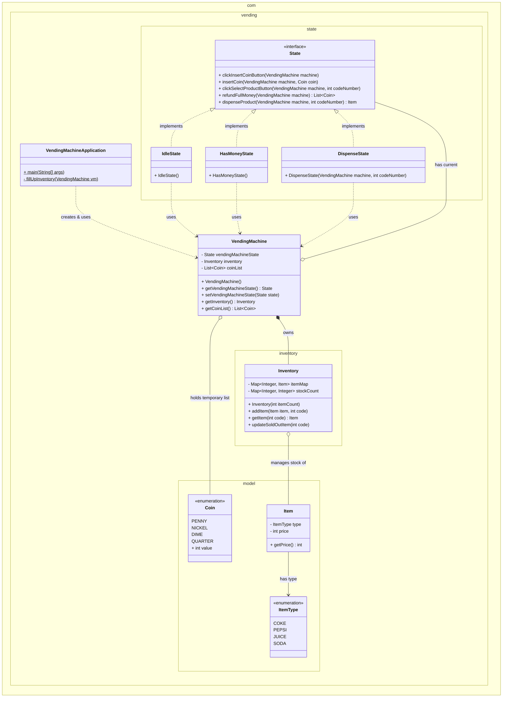

# Low-Level Design: Vending Machine (State Pattern)

## 1. Project Overview
This project implements the control software for a Vending Machine using the **State Design Pattern**. The primary goal is to decouple the machine's behavior from its state transitions, eliminating complex `if-else` or `switch-case` logic that often leads to spaghetti code.

### Directory Structure
```text
src/
└── com/
    └── vending/
        ├── VendingMachineApplication.java  [Driver]
        ├── VendingMachine.java             [Context]
        ├── inventory/
        │   └── Inventory.java              [Storage Logic]
        ├── model/
        │   ├── Coin.java                   [Enum]
        │   ├── Item.java                   [Entity]
        │   └── ItemType.java               [Enum]
        └── state/
            ├── State.java                  [Interface]
            ├── IdleState.java              [Concrete State]
            ├── HasMoneyState.java          [Concrete State]
            └── DispenseState.java          [Concrete State]
```

---
# Vending Machine UML Class Diagram

The following diagram illustrates the Low-Level Design (LLD) of the Vending Machine. It highlights the **State Design Pattern**, package organizations, and the relationships between the core context, states, inventory, and models.

### Key Diagram Elements:
* **Namespaces:** Groupings reflect the Java package structure (`com.vending`, `com.vending.state`, etc.).
* **`<<interface>> State`**: The central interface defining behavior.
* **Realization (`..|>`):** The dashed arrows showing that `IdleState`, `HasMoneyState`, and `DispenseState` implement the `State` interface.
* **Composition (`*--`):** The solid diamond indicating strong ownership (e.g., `VendingMachine` owns `Inventory`).
* **Aggregation (`o--`):** The hollow diamond indicating a "has-a" relationship where the lifecycle might not be bound (e.g., `VendingMachine` holds a reference to the current `State`).
* **Dependency (`..>`):** The dashed arrow indicating that one class uses another (e.g., concrete States use the `VendingMachine` context to call setters).



## 2. Component Analysis & Design Rationale

### A. The State Package (`com.vending.state`)

This is the core of the architecture. It defines the behavior of the machine at any given moment.

#### `State.java` (Interface)
- **Role:** Defines the contract for all possible actions a user can perform on the machine (Insert Coin, Select Product, Refund, Dispense).
- **Why used?** It enforces polymorphism. The Context (`VendingMachine`) doesn't need to know *how* an action is handled, only that the current state *can* handle it.

#### `IdleState.java`
- **Role:** Represents the machine waiting for a user.
- **Why used?** It acts as the default state. It enforces the rule that you cannot insert coins or select products until you explicitly interact with the interface (e.g., pressing "Start" or "Insert Coin").
- **Logic:** Rejects product selection; accepts "Insert Coin" triggers.

#### `HasMoneyState.java`
- **Role:** Represents the state after the user has started a transaction and is feeding coins.
- **Why used?** This isolates the payment logic. It handles coin accumulation and allows for full refunds before a product is chosen.
- **Logic:** Accepts coins; allows refunds; transitions to `DispenseState` upon valid selection.

#### `DispenseState.java`
- **Role:** Represents the internal processing of delivering the item.
- **Why used?** To prevent race conditions or double actions. While the machine is physically moving the motor to drop a soda, it should not accept new coins or allow a refund.
- **Logic:** Locks all user inputs; triggers inventory updates; returns to `IdleState`.

---

### B. The Inventory Package (`com.vending.inventory`)

#### `Inventory.java`
- **Role:** Manages the storage of items and their quantities.
- **Why used?** **Single Responsibility Principle (SRP).** The Vending Machine state logic shouldn't care *how* items are stored (Array, Map, Database). Separating this allows us to change the storage mechanism without breaking the state logic.
- **Logic:** Uses a `Map<Integer, Item>` for O(1) retrieval based on the code (e.g., 101).

---

### C. The Model Package (`com.vending.model`)

#### `Coin.java` (Enum)
- **Role:** Enumerates accepted currency (Penny, Nickel, Dime, Quarter).
- **Why used?** **Type Safety.** It prevents the system from accepting invalid integers (e.g., a coin value of 33 cents). Using an Enum makes the code rigid against invalid hardware inputs.

#### `ItemType.java` (Enum) & `Item.java`
- **Role:** Defines the products sold.
- **Why used?** Decoupling the "Type" from the "Instance". You might have 10 physical cans of Coke (`Item`), but they all share the same `ItemType`.

---

### D. The Core Package (`com.vending`)

#### `VendingMachine.java` (Context)
- **Role:** The main container that holds the current `State` object and the `Inventory`.
- **Why used?** This acts as the **Context** in the State Pattern. It delegates all requests to `state.action()`. Clients (the main app) interact with this class, not the states directly.

---

## 3. Senior Level Interview Q&A (Deep Dive)

If you are presenting this design in a Senior Interview, expect questions that probe Concurrency, Extensibility, and Real-world constraints.

### Q1: Why did you choose the State Pattern over a simple centralized `if-else` manager?
**Answer:**
"In a Vending Machine, the response to an event depends entirely on history. Pressing 'Select Button' does nothing in `IdleState` but dispenses an item in `HasMoneyState`.
If we used `if-else`, we would have a monolithic class with flags like `isMoneyInserted`, `isDispensing`, etc. This violates the **Open/Closed Principle**. If we wanted to add a 'Maintenance State', we'd have to rewrite the entire conditioned logic. With the State Pattern, I simply create a `MaintenanceState` class implementing the interface."

### Q2: How would you handle Concurrency? (Two users trying to buy the last Coke at the same moment)
**Answer:**
"Since the Vending Machine is a physical singleton device, we usually only have one active user session. However, in a distributed system (or a smart vending machine with an app), race conditions can occur.
I would implement locking in the `Inventory` class. The `updateSoldOutItem` or `dispense` method should be `synchronized`.
Alternatively, we can use Java's `AtomicInteger` for stock counts or `ConcurrentHashMap` for the inventory storage to ensure thread safety without heavy locking overhead."

### Q3: How would you implement the 'Return Change' algorithm efficiently?
**Answer:**
"The current design returns the exact same coin objects inserted on cancel. To return change (e.g., Item costs 45, User put 50), I would implement a **Chain of Responsibility Pattern** or a **Greedy Algorithm**.
We would sort the available internal coin inventory from largest to smallest (Quarter -> Dime -> Nickel) and subtract the value until the remaining change is 0. If the machine doesn't have enough loose change, we must throw an `InsufficientChangeException` before the transaction completes."

### Q4: We want to add Credit Card payments. How does this affect your design?
**Answer:**
"This highlights the strength of the State Pattern.
1. We don't need to change `IdleState` or `DispenseState`.
2. We would modify `HasMoneyState` to accept a `PaymentStrategy` (Strategy Pattern).
3. The `insertCoin` method might need to be abstracted to `processPayment()`.
   The Credit Card flow is just another way to transition from `Idle` -> `Dispense`."

### Q5: How does the software talk to the hardware (Motors, Sensors)?
**Answer:**
"In a real LLD, we shouldn't manipulate the hardware directly in the State classes. We would create a **Hardware Abstraction Layer (HAL)** or Adapter interfaces.
For example, `DispenseState` would call `motorController.rotate(slotId)`. This allows us to unit test the logic with a `MockMotorController` without needing the physical machine."