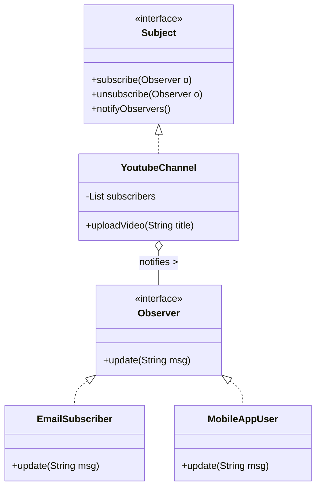

# 📹 YouTube Observer Pattern Implementation


> A clean, modular Java implementation of the **Observer Design Pattern** simulating a real-world YouTube subscription system.

---

## 📖 Overview

In this project, we simulate the relationship between a **YouTube Channel** and its **Subscribers**.

* **The Subject (Publisher):** The YouTube Channel. It holds the state (content).
* **The Observer (Subscriber):** The Users. They wait for notifications.

**The Workflow:**
When a channel uploads a video, it automatically "pushes" a notification to all registered subscribers. The subscribers handle this notification differently based on their specific implementation (e.g., an Email vs. a Mobile Push Notification).

---

## 🏗️ Architecture & Design

### UML Diagram

---

## 📂 Project Structure

The project is organized into packages to demonstrate separation of concerns and clean architecture.

```text
ObserverPattern/
├── src/
│   └── com/
│       └── designpatterns/
│           ├── interfaces/             <-- Contracts (API)
│           │   ├── Subject.java
│           │   └── Observer.java
│           ├── subject/                <-- The Publisher
│           │   └── YoutubeChannel.java
│           ├── observers/              <-- The Subscribers
│           │   ├── EmailSubscriber.java
│           │   └── MobileAppUser.java
│           └── main/                   <-- Execution
│               └── YoutubeApp.java
```

### 🧠 Core Concepts & Code Explanation

1. The Interfaces (```/interfaces```)
We use interfaces to decouple the Channel from the Users. The Channel doesn't need to know who the users are, only that they can be notified.

| Interface | Role | Key Methods |
| :--- | :--- | :--- |
| **Subject** | The "Publisher" contract | `subscribe()`, `unsubscribe()`, `notifyObservers()` |
| **Observer** | The "Subscriber" contract | `update(String msg)` |


- ```Subject.java```: Defines the methods any publisher must have:

    - ```subscribe(Observer observer)```: Add someone to the list.

    - ```unsubscribe(Observer observer)```: Remove someone from the list.

    - ```notifyObservers()```: Alert everyone in the list.

```Observer.java```: Defines the single method update(String msg) that allows an object to receive alerts.

2. The Subject (```/subject```)
- ```YoutubeChannel.java```: This is the core logic.
    - It maintains a ```List<Observer> subscribers```.
    - Key Logic: When ```uploadVideo()``` is called, it triggers ```notifyObservers()```, which loops through the list and calls ```.update()``` on every subscriber.


3. The Observers (```/observers```)
We have two different classes implementing the same ```Observer``` interface. This demonstrates Polymorphism—the Subject treats them exactly the same, but they behave differently.

- ```EmailSubscriber.java```: Simulates sending an email alert in its ```update()``` method.

- ```MobileAppUser.java```: Simulates a phone push notification in its ```update()``` method.

🚀 How to Run
Prerequisites
- Java Development Kit (JDK) 8 or higher.
- A terminal or command prompt.

### Step 1: Compilation
Navigate to the ```src``` directory. You must compile the Main class and include all dependencies in the compilation path.

```bash
cd ObserverPattern/src
javac com/designpatterns/main/YoutubeApp.java \
      com/designpatterns/interfaces/*.java \
      com/designpatterns/subject/*.java \
      com/designpatterns/observers/*.java
```

### Step 2: Execution
Run the application using the fully qualified package name.

```bash
java com.designpatterns.main.YoutubeApp
```

📝 Example Scenario & Output
When you run the application, the following sequence occurs:

1. **Setup**: A channel "CodeWithJava" is created.

2. **Subscription**: Alice (Email), Bob (Email), and Charlie (Mobile) subscribe.

3. **Event 1**: "CodeWithJava" uploads a video. -> All 3 get notified.

4. **Unsubscription**: Bob unsubscribes.

5. **Event 2**: "CodeWithJava" uploads another video. -> Only Alice and Charlie get notified.

```text
[System] New subscriber added to CodeWithJava
[System] New subscriber added to CodeWithJava
[System] New subscriber added to CodeWithJava

--- Channel 'CodeWithJava' is uploading: Observer Pattern in Java ---
  [Email Alert] Sent to alice@example.com: New video 'Observer Pattern in Java' is now live!
  [Email Alert] Sent to bob@work.com: New video 'Observer Pattern in Java' is now live!
  [Push Notification] Hey CharlieDev! Check out: Observer Pattern in Java

[System] Subscriber removed from CodeWithJava

--- Channel 'CodeWithJava' is uploading: Advanced Microservices ---
  [Email Alert] Sent to alice@example.com: New video 'Advanced Microservices' is now live!
  [Push Notification] Hey CharlieDev! Check out: Advanced Microservices
```

💡 Why use this pattern?
Without this pattern, ```YoutubeChannel``` would be tightly coupled to specific user classes (e.g., ```if (user is email) sendEmail()```).

Key Benefits:

 - ✅ Open/Closed Principle: You can add a ```TVAppSubscriber``` or ```SmartWatchSubscriber``` later without changing a single line of code in the Channel class.

 - ✅ Loose Coupling: The Subject interacts only with the ```Observer``` interface, making the system flexible and easier to test.

