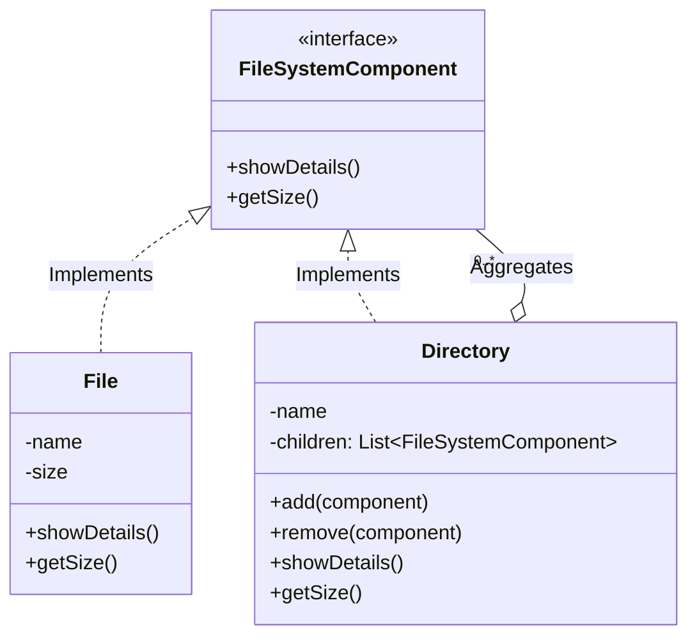

# File System Architecture: Composite Design Pattern

This document details the architectural design of a hierarchical file system using the **Composite Design Pattern**. This approach provides a uniform way to handle individual files and directories, simplifying client interaction with the tree structure.

## 1. Project Structure Overview

The design follows a separation of concerns by isolating the component interface, the leaf nodes (Files), and the composite nodes (Directories).

```text
src/
└── filesystem/
    ├── component/
    │   └── FileSystemComponent   (The common abstraction)
    ├── leaf/
    │   └── File                  (The data holding unit)
    ├── composite/
    │   └── Directory             (The container unit)
    └── FileSystemClient          (The driver/usage entry point)
```

---

## 2. Class Roles & Responsibilities

### **A. The Component Interface (`FileSystemComponent`)**
* **Role:** The base abstraction for all elements in the file system.
* **Responsibility:** Defines the contract for common operations (e.g., `showDetails`, `getSize`, `delete`).
* **Significance:** This allows the Client to ignore the difference between a simple file and a complex folder structure.

### **B. The Leaf (`File`)**
* **Role:** Represents the end-objects in the structure.
* **Responsibility:** Implements the core business logic (e.g., rendering file content, returning file size).
* **Behavior:** Leaf nodes do **not** have children.

### **C. The Composite (`Directory`)**
* **Role:** A container that holds a collection of `FileSystemComponent` items (both Files and other Directories).
* **Responsibility:**
    1.  **Child Management:** Provides methods to `add` or `remove` components.
    2.  **Delegation:** When an operation (like `showDetails`) is called, the Directory iterates through its children and delegates the command to them recursively.

### **D. The Client**
* **Role:** The consumer of the API.
* **Behavior:** It interacts strictly via the `FileSystemComponent` interface. It builds the tree by initializing components and assembling them, then triggers operations on the root node.

---

## 3. UML Class Diagram

The following Mermaid diagram illustrates the relationships. Note the "Aggregation" relationship (white diamond) indicating that a Directory *contains* Components.



---

## 4. Senior Level Interview Q&A

These questions target system design, scalability, and deeper understanding of the pattern's trade-offs.

### **Q1: Transparency vs. Safety Design Trade-off**
> **Interviewer:** *In the Composite pattern, where should we declare the `add()` and `remove()` methods: in the Component interface or the Composite class?*

**Answer:**
This is the "Transparency vs. Safety" dilemma:
* **Transparency:** Declaring `add()` in the Interface makes `File` and `Directory` look identical to the client. However, `File` must implement `add()` (likely throwing an exception), which is unsafe at runtime.
* **Safety:** Declaring `add()` only in `Directory` ensures you never call it on a `File` (compile-time safety). However, the client must treat `Directory` specifically as a `Directory` during the building phase.
* *Verdict:* For a strict file system, **Safety** is usually preferred to avoid runtime exceptions.

### **Q2: Handling Cycles (Infinite Recursion)**
> **Interviewer:** *How do you prevent a user from creating an infinite loop, such as adding Folder A inside Folder B, and then adding Folder B inside Folder A?*

**Answer:**
Standard Composite implementation doesn't prevent this. To fix it:
1.  **Ancestor Check:** Before adding a child, traverse up the parent chain of the destination folder. If the child being added appears in the ancestry, reject the operation.
2.  **Visited Set:** During traversal (e.g., `getSize`), maintain a `Set` of visited node IDs. If a node is visited twice in the same stack, a cycle exists.

> **Interviewer:** *What happens if a user accidentally adds a Directory inside itself (e.g., `dirA.add(dirA)`)? How would you fix the `StackOverflowError`?*

**Answer:**
Infinite recursion will occur. To fix this in a production system:
1.  **Set Checking:** Maintain a `Set<FileSystemComponent>` of visited nodes during the recursion path. If we encounter a node already in the current stack, stop.
2.  **Parent Pointer:** When adding a child, check if the child is already an ancestor of the current directory.

### **Q3: Concurrency & Thread Safety**
> **Interviewer:** *This structure is not thread-safe. How do we handle multiple threads reading and writing to the File System simultaneously?*

**Answer:**
* **Read-Heavy Workloads:** Use `ReadWriteLock`. Allow multiple threads to call `showDetails()` or `getSize()` (Read Lock), but force exclusive access for `add()` or `remove()` (Write Lock).
* **Iteration Safety:** If a thread is iterating through children while another adds a file, a `ConcurrentModificationException` may occur. Use `CopyOnWriteArrayList` for the children list or snapshot iterators to solve this.

### **Q4: Performance Optimization (Caching)**
> **Interviewer:** *Calculating `getSize()` on the Root folder of a massive drive is slow because it traverses the whole tree. How do we optimize this?*

**Answer:**
Implement **Caching with Event Bubbling**:
1.  Store a `totalSize` variable in every `Directory`.
2.  When a file is added/modified, calculate the delta and "bubble up" the change to all parent directories, updating their cached `totalSize`.
3.  `getSize()` becomes an O(1) operation instead of O(N).

> **Interviewer:** *This code is single-threaded. How would you make the `Directory` class thread-safe for a scenario where multiple threads are reading and writing files simultaneously?*

**Answer:**
Using a standard `ArrayList` is not thread-safe.
1.  **Coarse-grained locking:** Make methods `synchronized`. Simple, but performance will suffer on heavy reads.
2.  **Fine-grained locking (Better):** Use `ReadWriteLock`. Multiple threads can read (`showDetails`) simultaneously, but `add/remove` acquires a write lock.
3.  **CopyOnWrite:** Use `CopyOnWriteArrayList` for the children list if reads vastly outnumber writes.

### **Q5: Distributed Systems Scaling**
> **Interviewer:** *How does this design change if the file system is distributed (like HDFS or S3) rather than local?*

**Answer:**
The Composite pattern (object recursion) does not scale well over networks due to latency.
* **Metadata Separation:** We would separate the metadata (Directory structure/pointers) from the actual data blocks (File content).
* **Flat Address Space:** Instead of deep recursion, we might use a hash-based lookup or an Inode table where a Directory simply lists IDs of its children, fetching them in parallel batches rather than sequential recursion.

### **Q6: Searching Strategy**

**Interviewer:**
> *How would you implement a `search(String name)` feature within this hierarchy?*

**Answer:**
This is fundamentally a **Graph Traversal** problem. We can choose between two standard algorithms based on the specific use case:

* **DFS (Depth First Search):**
  * **Mechanism:** The current recursive implementation of the Composite pattern is naturally DFS. It dives down one branch completely before moving to the next.
  * **Pros:** Simple to implement (uses the call stack). Efficient if the target file is expected to be deep in the directory structure.

* **BFS (Breadth First Search):**
  * **Mechanism:** We use an iterative approach with a `Queue` (FIFO) to explore the tree level-by-level.
  * **Pros:** Better if we want to find files located closer to the `Root` directory first. It also avoids `StackOverflowError` if the directory nesting is extremely deep.

# Search Algorithms in File System Design

This document details the logic and implementation location of the **DFS** (Depth-First Search) and **BFS** (Breadth-First Search) algorithms within the Composite Design Pattern structure.

---

## 1. Depth-First Search (DFS)

### **Concept**
DFS is the "natural" search strategy for the Composite pattern because the pattern itself relies on recursion. DFS explores a branch as deeply as possible before backtracking.

* **Logic:**
  1.  Check if the current node matches the search keyword.
  2.  If not, iterate through the children.
  3.  Call `searchDFS()` on each child (recursive step).
  4.  If a child returns a result, propagate it up the stack.

### **Classes Used**

* **`FileSystemComponent` (Interface):**
  * **Role:** Defines the contract `searchDFS(String keyword)`. This ensures that every node in the tree (whether a file or a folder) knows how to handle a search request.
  * **Why here?** To allow polymorphism. The client does not need to know if it is asking a File or a Directory to search; it just calls the method.

* **`File` (Leaf):**
  * **Role:** Implements the **Base Case** of the recursion.
  * **Logic:** It simply checks: *"Is my name the keyword?"* If yes, return `this`; otherwise, return `null`.

* **`Directory` (Composite):**
  * **Role:** Implements the **Recursive Step**.
  * **Logic:** It checks itself first. If not found, it loops through its `children` list and delegates the search to them.

---

## 2. Breadth-First Search (BFS)

### **Concept**
BFS explores the tree level-by-level. It checks all files in the current directory before moving deeper into sub-directories. This is iterative rather than recursive.

* **Logic:**
  1.  Create a **Queue** (FIFO data structure).
  2.  Add the starting directory to the Queue.
  3.  While the Queue is not empty:
    * Remove the front element.
    * Check if it matches the keyword.
    * If the element is a `Directory`, add all its immediate children to the back of the Queue.

### **Classes Used**

* **`Directory` (Composite):**
  * **Role:** Contains the entire logic for the BFS algorithm.
  * **Why here?** BFS requires knowledge of the `children` list to populate the Queue. Since `File` nodes (Leaves) do not have children, the traversal logic is best encapsulated within the container class.
  * **Key Dependencies:** Uses `java.util.Queue` and `java.util.LinkedList` to manage the traversal order.

---

## 3. Comparison Summary

| Feature | DFS (Recursive) | BFS (Iterative) |
| :--- | :--- | :--- |
| **Primary Class** | `FileSystemComponent` (Polymorphic) | `Directory` (Specific) |
| **Data Structure** | Call Stack (System managed) | Queue (User managed) |
| **Search Order** | Dives deep immediately. | Scans current folder completely first. |
| **Best For** | Finding files known to be deep in the tree. | Finding files closer to the root (Top-level). |